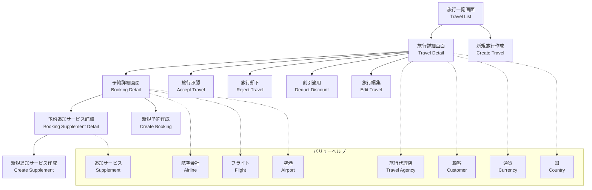
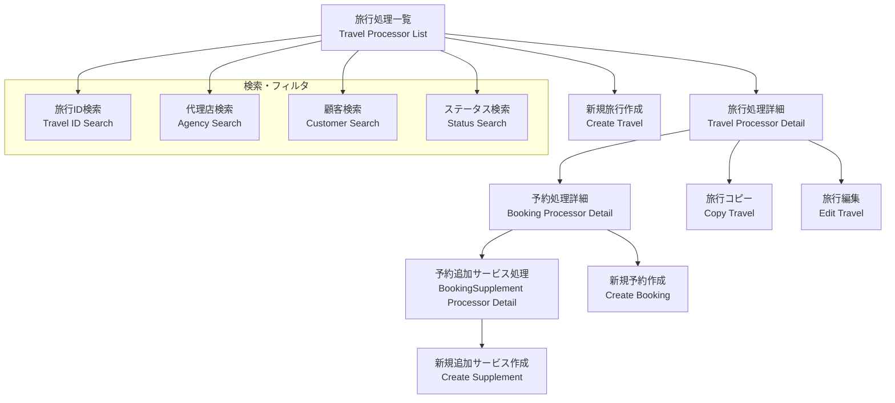
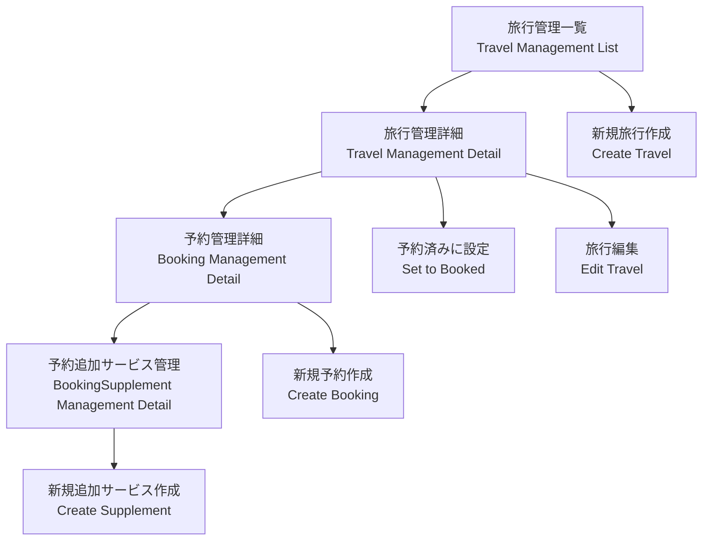
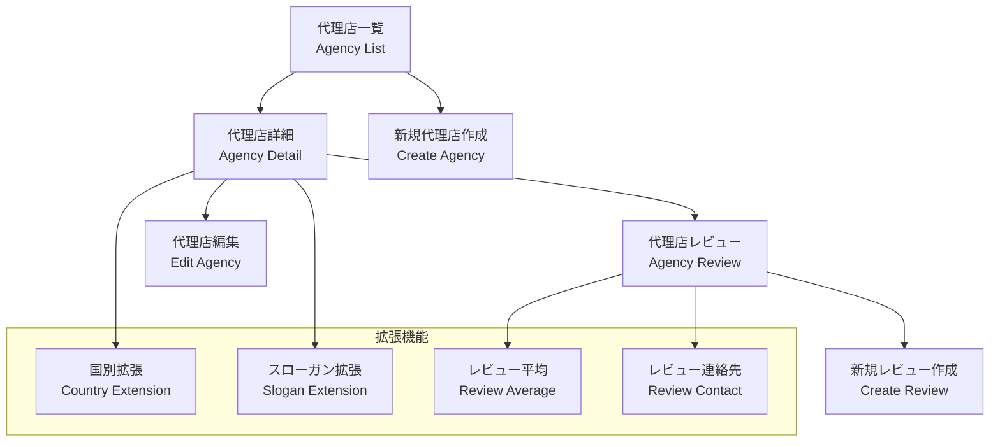
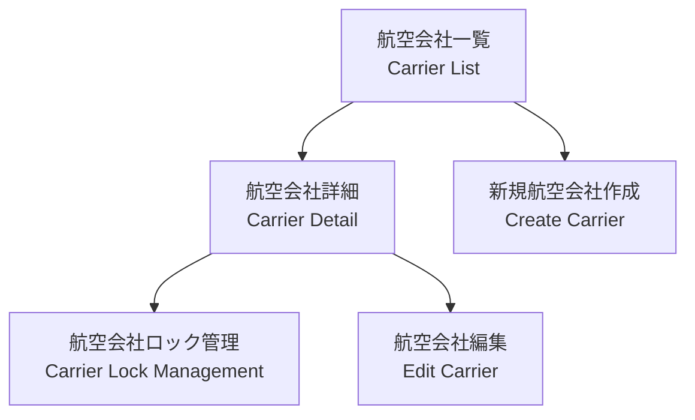
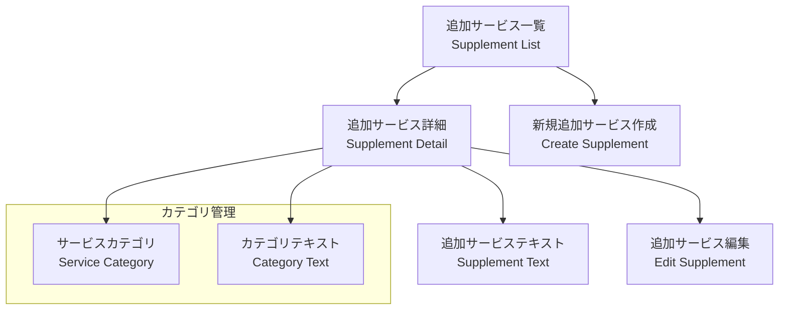

# ABAP Platform Flight Reference Scenario - 画面遷移図

## 概要
このドキュメントは、ABAP Platform Flight Reference Scenarioの画面遷移とナビゲーション構造を説明します。

## システム構成
本システムは以下の3つの主要なシナリオで構成されています：

1. **Draft シナリオ** - ドラフト機能付き旅行管理
2. **Managed シナリオ** - 管理された旅行管理
3. **Unmanaged シナリオ** - 非管理旅行管理

## 画面遷移図

### 1. Draft シナリオ (/DMO/UI_TRAVEL_A_D)



### 2. Managed シナリオ (/DMO/UI_TRAVEL_Processor_M)



### 3. Unmanaged シナリオ (/DMO/TRAVEL_U)



### 4. 代理店管理 (/DMO/UI_AGENCY)



### 5. 航空会社管理 (/DMO/UI_CARRIERS_S)



### 6. 追加サービス管理 (/DMO/UI_SUPPLEMENT)



## 画面要素詳細

### 共通UI要素

#### 1. リスト画面（Line Item）
- **表示項目**: ID、名前、ステータス、日付、金額
- **操作**: 検索、フィルタ、ソート、選択
- **アクション**: 新規作成、編集、削除

#### 2. 詳細画面（Object Page）
- **ファセット構成**:
  - 識別情報（Identification）
  - 関連エンティティ（LineItem Reference）
- **操作**: 編集、保存、キャンセル
- **アクション**: ビジネスアクション（承認、却下等）

#### 3. バリューヘルプ画面
- **目的**: 関連データの選択
- **機能**: 検索、フィルタ、選択
- **データ**: 代理店、顧客、航空会社、フライト等

### 画面遷移パターン

#### 1. 階層ナビゲーション
```
旅行 → 予約 → 追加サービス
```

#### 2. 関連エンティティナビゲーション
```
旅行 ↔ 代理店
旅行 ↔ 顧客
予約 ↔ 航空会社
予約 ↔ フライト
```

#### 3. アクションベースナビゲーション
```
リスト → 詳細 → アクション実行 → 結果表示
```

## 技術的な画面制御

### 1. 権限制御
- **認可チェック**: `@AccessControl.authorizationCheck: #NOT_REQUIRED`
- **フィールドレベル**: 読み取り専用、隠し項目

### 2. 検索機能
- **デフォルト検索**: `@Search.defaultSearchElement: true`
- **検索可能**: `@Search.searchable: true`

### 3. UI注釈
- **表示制御**: `@UI.hidden: true`
- **重要度**: `importance: #HIGH|#MEDIUM|#LOW`
- **配置**: `position: [数値]`

### 4. テキスト表示
- **テキスト要素**: `@ObjectModel.text.element`
- **テキスト配置**: `@UI.textArrangement: #TEXT_ONLY`
- **ローカライズ**: `localized`

## まとめ
このABAP Platform Flight Reference Scenarioは、以下の画面パターンを実装しています：

1. **マスターディテール**: 一覧から詳細への遷移
2. **階層ナビゲーション**: 親子関係のあるエンティティ間の遷移
3. **バリューヘルプ**: 関連データの選択画面
4. **アクション実行**: ビジネスロジックの実行画面
5. **ドラフト機能**: 一時保存機能付きの編集画面

これらの画面パターンは、現代的なSAP Fioriアプリケーションの標準的な構成を示しており、RAP（RESTful Application Programming）モデルの実装例として参考になります。